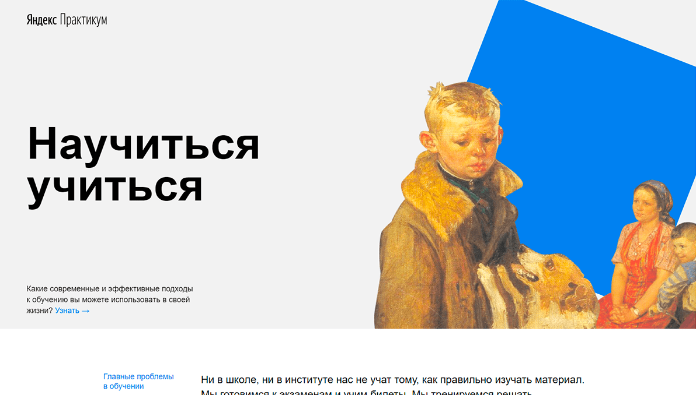

# Научиться учиться. Домашняя работа на Яндекс.Практикум

Данный проект является результатом обучения на курсе от Яндекс.Практикум.
Это первая созданная страница с помощь HTML и CSS.

На странице релизованны:

1. Flexbox вёрстка
2. CSS-анимация
3. Файловая структура проекта по правилам Nested БЭМ

## Ссылка на проект

   [Страница Научиться учиться](https://kiars1.github.io/how-to-learn)
   
   

## Развитие проекта

В дальнейшем планируется: 
✅ Адаптация сайта по мобильные устройсва. 
